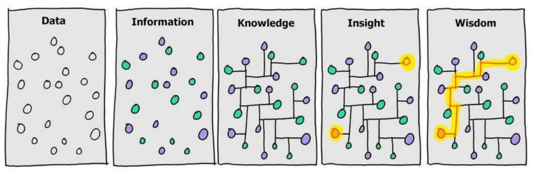

Traditional note taking quickly becomes just an archive. I've taken notes for years in random places that I never revisit. 
I've realised that I wasn't building knowledge, I was storing information.
# What is Personal Knowledge Management?
Lately, I've been getting into the concepts of digital gardening and personal knowledge management systems (PKMS).

The most important word is **Personal**. 

There are popular frameworks like [Zettelkasten](https://zettelkasten.de/introduction/) or the [PARA method](https://fortelabs.com/blog/para/), but there isn't one singular correct system. They are great sources of inspiration, but ultimately **you have to find what works for you**.

The best system is the one that matches how **you** think and one you'll still enjoy using years from now.

These are the concepts that have had the biggest impact on how I organise my own knowledge.
## Concept 1: Capture small ideas and let them grow... or die
<figure> 
	 
	<figcaption>A digital garden (Credit: <a href="https://www.pexels.com/@andy-lee-222330306/">Andy Lee</a>)</figcaption>
</figure>

Not every idea is worth developing, but almost every idea is worth capturing while it's fresh.
### Reduce friction & keep notes small
Reducing friction is key. The easier it is to write something down, the more likely I am to do it.

Keeping notes small also makes them easier to connect, refine, and reuse later.
### Digital gardening
Instead of expecting every note to be perfect from the beginning, I let ideas evolve over time.

A rough thought today might become a connected note next week and eventually grow into a complete concept or even a blog post.
## Concept 2: Separate knowledge from information
<figure> 
	 
	<figcaption>The next 2 concepts remind me of this I found in <a href="https://forum.obsidian.md/t/knowledge-innovation-value-and-wisdom/5166">this thread</a>, which also has relevant info </figcaption>
</figure>

Not everything I consume deserves a permanent place in my knowledge base.

Books, blog posts, videos, podcasts and projects are **inputs**. Knowledge is the **output**. 

My personal rule is simple: **I only save external information if it contributes to my personal knowledge in some way, either by supporting an existing idea or inspiring a new one**.

Whenever I finish a project, a book, an article or a video, I write down what I learned and extract the ideas. Writing is how I learn best, this has been the case for years.
## Concept 3: Think in connections, not folders
**All my Knowledge notes are just in 1 folder**.

Folders answer one question:

> "Where should this note live?"

Links answer a much more interesting one:

> "How does this idea relate to other ideas?"

That's much closer to how we actually think.

Some people abandon folders entirely. I still use them, mostly for things around my main knowledge base. Examples:
- Temporal documents: Journals, meeting notes, todo lists, ...
- External resources: Blogs, Videos, Albums, ...
## Concept 4: Create ways to navigate your knowledge
<figure> 
	 
	<figcaption>Navigating with notes, a map, a compass and more. (Credit: <a href="https://www.pexels.com/@rachel-claire/">Rachel Claire</a>)</figcaption>
</figure>

The real organisation comes from links. To make those links more intentional, I use a simple mental compass.
For larger topics, I also create Maps of Content (MOCs) as curated starting points.
### My Compass system
For each knowledge node, this is my mental model for connections:
- **Parent (North)** — What bigger idea is this part of?
- **Related (West)** — Supporting ideas, examples or useful resources.
- **Opposite (East)** — What challenges or contradicts this?
- **Leads to (South)** — What questions, experiments or applications come next?

![[_attachements/Pasted image 20260803192609.png]]

Not every note needs all four directions. The compass isn't a rule—it's a prompt that encourages richer thinking.

A good place to start is asking:

> "What does this remind me of?"
### Maps
A MOC (Map of Content) isn't just an index, it's a curated starting point that explains how ideas relate to one another and provides context for whoever is trying to understand the topic—whether that's my future self or even an AI system.

**I don't create a map for every subject**. I only create an MOC when navigating a topic starts feeling harder than it should.
# An evolving system
**People change. Gardens grow**. Your knowledge system should evolve as you do.

You'll discover workflows that feel natural, abandon ones that create unnecessary maintenance, and gradually shape a system that reflects how you think.

**Start simple. Optimise only when something becomes painful.**

It's surprisingly easy to spend hours perfecting a knowledge management system instead of actually learning (aka working **on** Obsidian rather than **in** Obsidian). Which I definitely did not do... 🙈
# Inspiration and resources
- Connect Ideas with The Idea Compass and Visualize Connections with ExcaliBrain by Zsolt: https://www.youtube.com/watch?v=7rnsULzez-g
- Maps of Content - Organize and Think with MOCs 💭 by Vicky Zhao: https://www.youtube.com/watch?v=x7Ta9BhFR30&t=304s
- Nick Milo's channel on Linking your thinking: https://www.youtube.com/@linkingyourthinking

---

I'm still experimenting, so I don't know what this system will look like in five years. Maybe some of these ideas will stick, and others will disappear. That's part of the process.

What I do know is that **I've gone from collecting notes to actively developing ideas**, and that alone has made writing and learning far more enjoyable.

In the next post, I'll walk through how I've implemented these ideas in Obsidian. Here's a preview:
![[_attachements/Pasted image 20260803175602.png]]